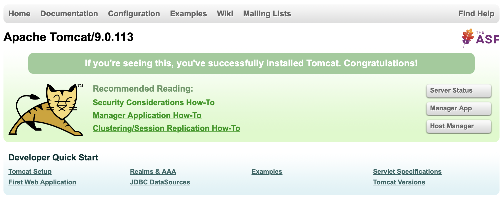
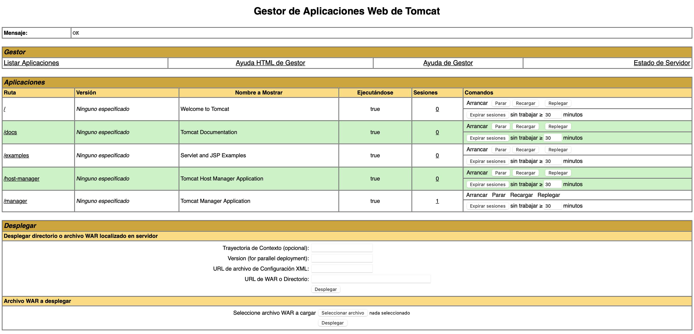
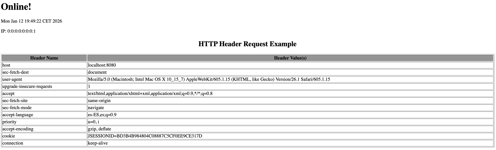
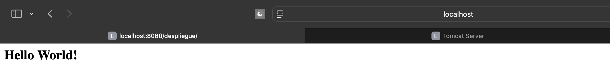
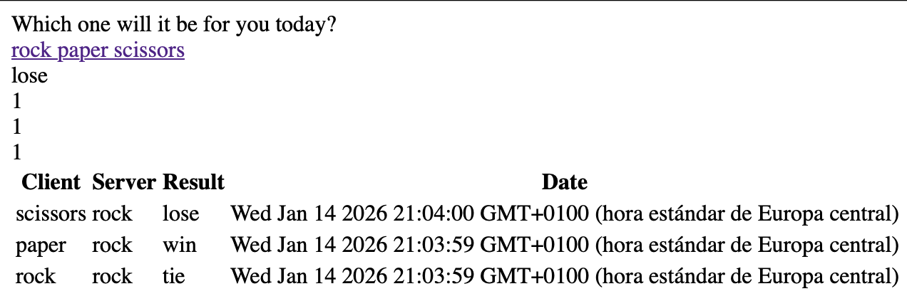

# Práctica: Despliegue de Aplicaciones Java con Tomcat y Maven

## 1. Instalación y Arranque de Tomcat
He descargado e instalado Apache Tomcat 9 (versión 9.0.113). Tras descomprimir el archivo y configurar los permisos de ejecución en la carpeta `bin` mediante la terminal, he arrancado el servidor correctamente.

**Captura 1:** Comprobación de que el servidor está funcionando correctamente (página de inicio).

## 2. Configuración de Usuarios y Acceso Remoto
Para poder acceder al gestor de aplicaciones ("Manager App"), he tenido que modificar los archivos de configuración del servidor:
- **`conf/tomcat-users.xml`**: He añadido el usuario "alumno" con roles de GUI (`manager-gui`) y el usuario "deploy" para el despliegue automático.
- **`webapps/manager/META-INF/context.xml`**: He eliminado la restricción de seguridad (`Valve`) que impedía el acceso.

**Captura 2:** Acceso exitoso al Gestor de Aplicaciones Web tras la autenticación.

## 3. Despliegue Manual de un WAR
He realizado una prueba de despliegue manual utilizando la interfaz web del Manager. He subido el archivo `tomcat1.war` proporcionado en los recursos de la práctica.

**Captura 3:** La aplicación `tomcat1` desplegada y ejecutándose correctamente (muestra las cabeceras HTTP).

## 4. Despliegue Automático con Maven
Finalmente, he configurado un entorno de desarrollo para desplegar aplicaciones automáticamente:
1. He instalado **Maven** (versión 3.9.12) y lo he añadido al PATH del sistema.
2. He configurado las credenciales del servidor en el archivo `settings.xml` de Maven.
3. He generado un proyecto web básico (`maven-archetype-webapp`) y he configurado el plugin `tomcat7-maven-plugin` en el archivo `pom.xml` para conectar con mi servidor local.
4. He ejecutado el comando `mvn tomcat7:deploy`.

**Captura 4:** Resultado final del despliegue automático con Maven (Hola Mundo).

## 5. Despliegue de Aplicación Adicional (Rock-Paper-Scissors)
Siguiendo las instrucciones de la tarea, he desplegado una segunda aplicación obtenida desde un repositorio externo.

1. **Clonado del repositorio:** He descargado el código desde GitHub y he cambiado a la rama específica `patch-1` tal y como indicaba el enunciado.
2. **Configuración:** - He añadido el plugin `tomcat7-maven-plugin` al `pom.xml` para desplegar en la ruta `/roshambo`.
   - He solucionado un error de compilación actualizando la versión de Java (source/target) de 1.7 a 1.8 en el `pom.xml`.
3. **Despliegue:** He ejecutado el comando `mvn tomcat7:deploy` obteniendo un resultado satisfactorio.

**Captura 5:** La aplicación Rock-Paper-Scissors funcionando correctamente.

